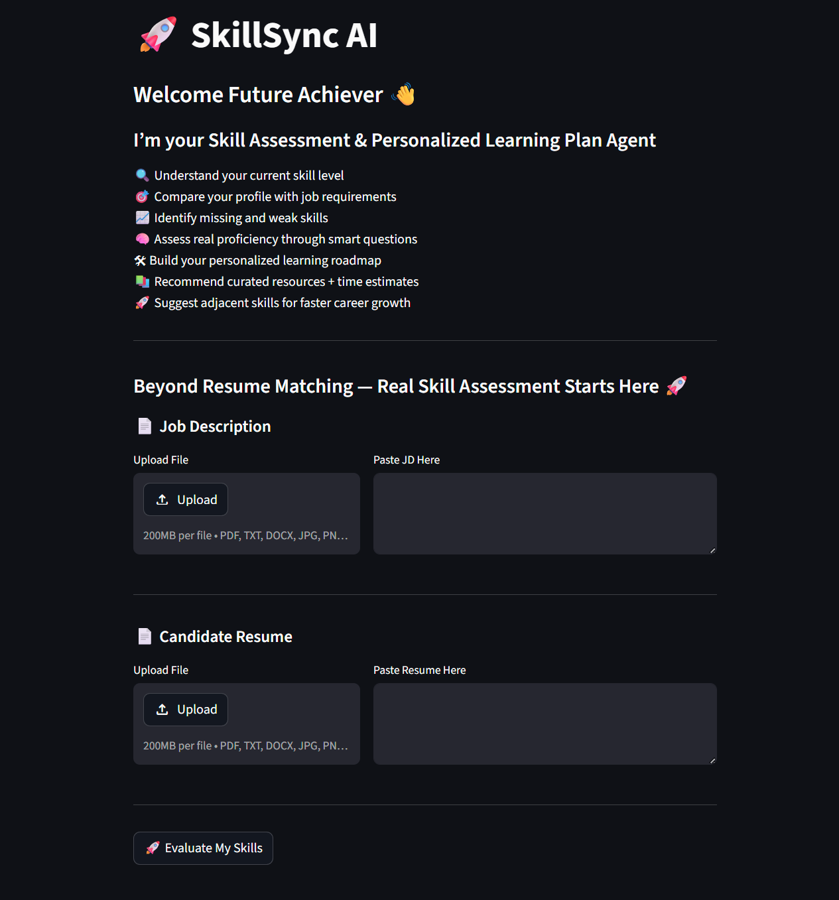
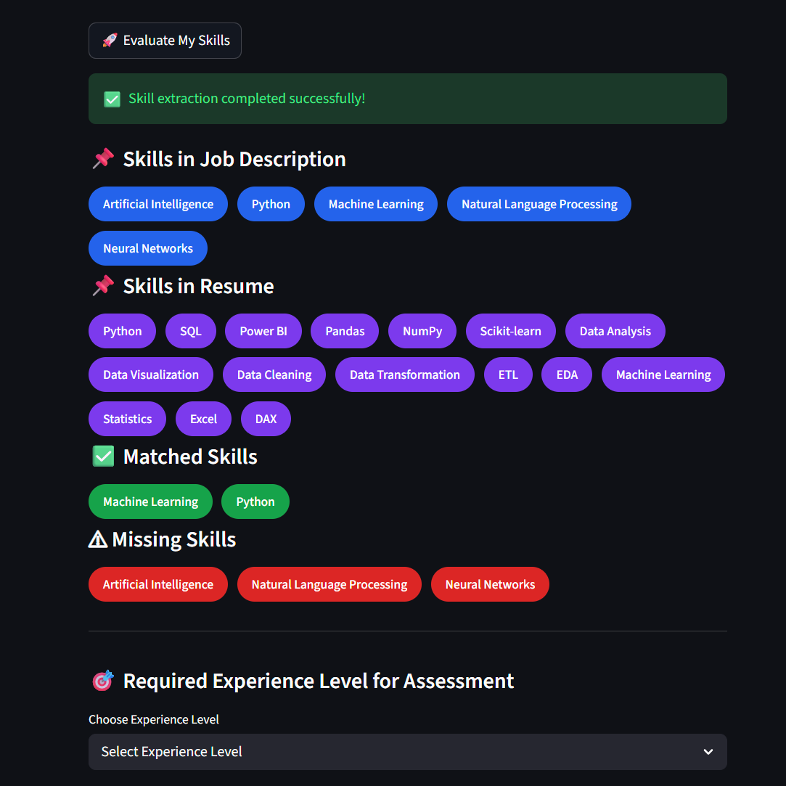
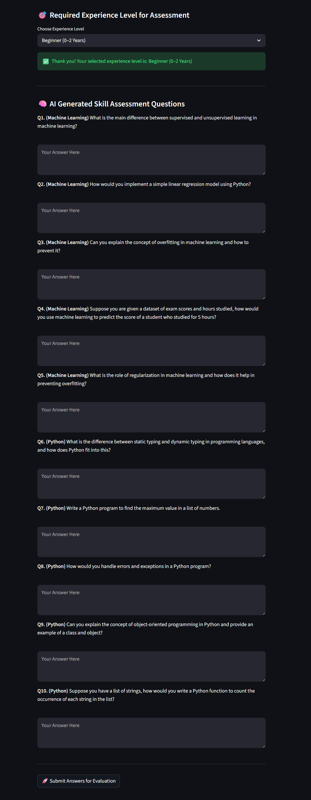
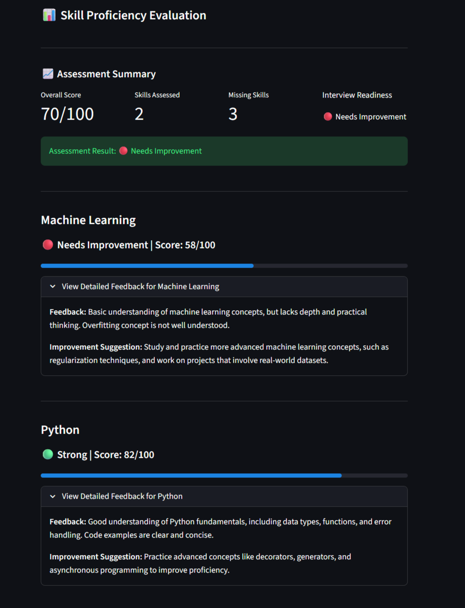
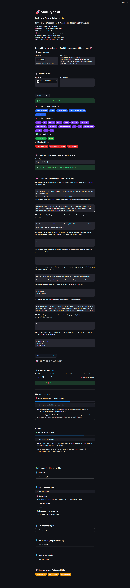

# 🚀 SkillSync AI

## AI-Powered Skill Assessment & Personalized Learning Plan Agent

### 📌 Problem Statement

Traditional resume screening only checks keyword matching between Job Description (JD) and Resume, but it does not accurately measure a candidate’s real proficiency.

Many candidates may mention skills in their resume without having strong practical knowledge, while recruiters struggle to identify actual skill gaps and interview readiness.

SkillSync AI solves this problem by going beyond resume matching and performing:

* Smart JD vs Resume skill matching
* Real proficiency assessment through dynamic interview questions
* Missing skill identification
* Personalized learning plan generation
* Adjacent skill recommendations for career growth

This helps candidates prepare better and helps recruiters evaluate smarter.

---

## ✨ Features

### 📄 JD + Resume Upload

* Upload PDF / DOCX / TXT files
* Or directly paste Job Description and Resume text

### 🧠 Smart Skill Extraction

* Extracts strong professional and technical skills using AI
* Ignores weak/generic mentions

### 🎯 Skill Matching

* Identifies:

  * Matched Skills
  * Missing Skills

### 📊 Experience-Based Skill Assessment

Supports:

* Beginner (0–2 Years)
* Intermediate (2–5 Years)
* Advanced (5+ Years)

Question difficulty changes based on experience level.

### 💬 Dynamic Question Generation

For Technical Roles:

* Conceptual questions
* Coding questions
* SQL / Database questions
* Scenario-based practical questions

For Non-Technical Roles:

* Theory questions
* Scenario-based decision questions
* Real workplace situations

### 📈 AI Proficiency Evaluation

For each skill:

* Proficiency Score out of 100
* Feedback
* Improvement Suggestions

### 📚 Personalized Learning Plan

Provides:

* Focus Area
* Time Estimate
* Recommended Resources
* Domain-based trusted platforms
* Famous YouTube educators/channels

### 🚀 Adjacent Skill Suggestions

Suggests additional skills candidates can learn for faster career growth.

---

## 🛠 Tech Stack

* Python
* Streamlit
* Groq API
* LLaMA 3.3 70B Versatile
* PyPDF2
* python-docx
* python-dotenv
* JSON Parsing

---

## 🔄 Project Flow

### Step 1

Upload or paste:

* Job Description
* Candidate Resume

↓

### Step 2

AI extracts important skills from both documents

↓

### Step 3

System identifies:

* Matched Skills
* Missing Skills

↓

### Step 4

User selects required Experience Level

↓

### Step 5

AI generates dynamic interview questions based on:

* matched skills
* role type
* experience level

↓

### Step 6

Candidate answers all questions

↓

### Step 7

AI evaluates proficiency and provides:

* score
* feedback
* suggestions

↓

### Step 8

System generates:

* Personalized Learning Plan
* Adjacent Skill Recommendations

---

## ⚙ Installation Steps

### 1. Clone Repository

```bash
git clone <your-github-repo-link>
cd SkillSync-AI
```

### 2. Install Required Libraries

```bash
pip install -r requirements.txt
```

### 3. Create `.env` File

Add your Groq API key:

```env
GROQ_API_KEY=your_api_key_here
```

### 4. Run the Project

```bash
streamlit run app.py
```

---

## 📷 Screenshots

### Home Page



---

### Skill Matching Result



---

### Question Generation



---

### Skill Proficiency Evaluation



---

### Personalized Learning Plan



---

## 🔐 Error Handling

Implemented for:

* Groq API failure
* Invalid JSON response
* Empty skill extraction
* Unsupported file handling
* Empty Resume/JD validation

This improves reliability and user experience.

---

## 🔮 Future Improvements

Planned upgrades:

* Voice-based interview answers
* Live coding editor for coding rounds
* ATS score prediction
* Resume improvement suggestions
* Authentication system
* Full deployment with cloud hosting
* Recruiter dashboard version

---

## 👨‍💻 Project Goal

To create a smarter, AI-powered hiring assistant that helps:

### Candidates

prepare better for interviews

### Recruiters

evaluate candidates beyond keyword matching with actual skill proficiency insights.

---

## ⭐ Final Outcome

SkillSync AI transforms a Resume into a Roadmap to Success.
